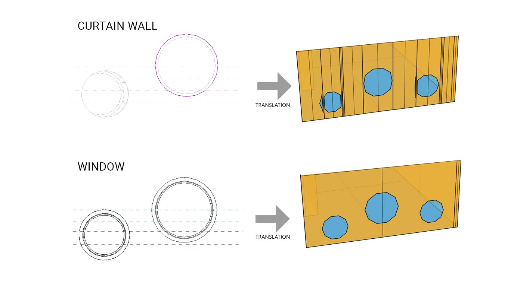

# Windows

## Non-rectilinear Windows

When creating non-rectilinear windows, use the correct family type to ensure a clean analytical model. In the example below, you can see how family type affects the translated analytical model. When a curtain wall is used to model a circular window, the analytical model has many more surfaces and the glazed areas are fragmented and misaligned. When a window family is used, the translated model is clean and requires no rework.

## Missing Apertures

If you don't see the apertures in the room it is usually because of one of the reasons below:

1. You haven't selected the aperture type as an aperture when exporting the model.
2. There is a room separation line next to the wall. That means the room object never touches the parent wall, and as a result, it doesn't find the aperture.
3. There is a room-bounding element before the main wall. This case is similar to the case for separation lines. See [this discussion](https://discourse.pollination.cloud/t/room2d-geometries-for-story-story-have-floor-elevations-that-are-too-different-from-one-another-to-be-a-part-of-the-same-story/2195/13) on the Pollination forum for more information.

